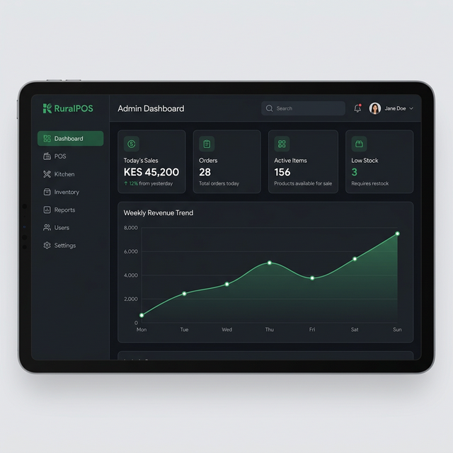
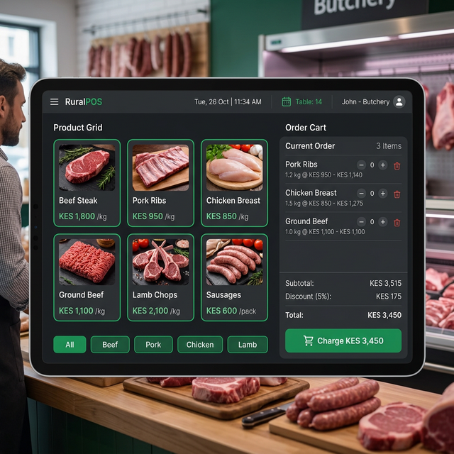
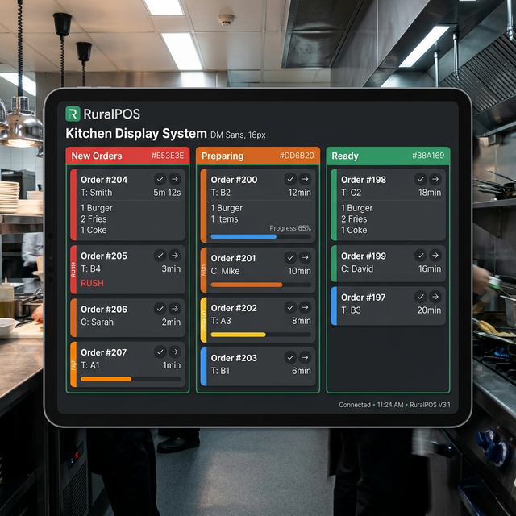

<![CDATA[# 🥩 RuralPOS — Offline-First Point of Sale System

> A production-grade, offline-first POS system built for butcheries, kitchens, and restaurants operating in areas with unreliable internet connectivity.



---

## 🎯 Problem Statement

Small-to-medium food businesses in rural areas lose revenue and operational data due to unreliable internet. Existing POS systems require constant connectivity, making them unusable during frequent outages.

**RuralPOS** solves this by running entirely offline on local SQLite, then seamlessly syncing to the cloud when connectivity returns — ensuring zero downtime and zero data loss.

---

## ✨ Key Features

| Feature | Details |
|---|---|
| 🔌 **Offline-First** | Full POS functionality with local SQLite — works with zero internet |
| ☁️ **Auto Cloud Sync** | Supabase Realtime WebSockets sync data across all devices when online |
| 📱 **Multi-Platform** | React Native mobile app (primary) + React web dashboard |
| 👥 **Role-Based Access** | Admin, Butchery, Kitchen, Chef, Inventory — each with tailored workflows |
| 🏢 **Multi-Tenant SaaS** | Isolated tenant data via `tenant_id` — one backend serves many businesses |
| 🔑 **License Key System** | Subscription management with 7-day offline grace period |
| 📦 **OTA Updates** | Push updates over-the-air via Expo — no physical device access needed |
| 🔄 **Background Sync** | 15-minute background fetch keeps data current even when app is backgrounded |
| 📊 **Reports & Analytics** | Daily sales summaries, revenue trends, and performance charts |
| 🧾 **Receipt Printing** | Thermal receipt printing support |
| 🥶 **Cold Storage Tracking** | Freezer item management with meat type and date tracking |
| 🐄 **Carcass Records** | Purchase weight, yield percentage, waste tracking per carcass |
| 📋 **Audit Logging** | Every significant action is recorded for accountability |

---

## 📸 Screenshots

<p align="center">
  
  
</p>
<p align="center">
  
</p>

---

## 🏗️ Architecture Overview

```
┌───────────────────────────────────────────────────────────┐
│                    MOBILE TABLETS (Primary POS)           │
│              React Native · Expo · SQLite · Zustand       │
│                                                           │
│   ┌──────────┐  ┌──────────┐  ┌──────────┐  ┌─────────┐ │
│   │ Butchery │  │ Kitchen  │  │   Chef   │  │Inventory│ │
│   │   POS    │  │ Display  │  │ Station  │  │  Mgmt   │ │
│   └────┬─────┘  └────┬─────┘  └────┬─────┘  └────┬────┘ │
│        └──────────────┼─────────────┼─────────────┘      │
│                  ┌────▼────┐                              │
│                  │ SQLite  │ ← Local-first storage        │
│                  └────┬────┘                              │
└───────────────────────┼───────────────────────────────────┘
                        │
                   Sync Service
              (Queue + Realtime WS)
                        │
┌───────────────────────┼───────────────────────────────────┐
│                  ┌────▼────┐                              │
│                  │Supabase │                              │
│                  │Postgres │ ← Cloud source of truth      │
│                  └────┬────┘                              │
│                       │                                   │
│   ┌───────────────────┼──────────────────┐                │
│   │                   │                  │                │
│   ▼                   ▼                  ▼                │
│ Realtime WS       Row Level          RPC Functions        │
│ (Live Sync)       Security           (License Auth)       │
│                                                           │
│                  SUPABASE CLOUD                           │
└───────────────────────────────────────────────────────────┘
                        │
┌───────────────────────┼───────────────────────────────────┐
│              ┌────────▼────────┐                          │
│              │  Web Dashboard  │                          │
│              │  React · Vite   │                          │
│              └────────┬────────┘                          │
│                       │                                   │
│              ┌────────▼────────┐                          │
│              │ Admin Portal    │                          │
│              │ Next.js (SaaS)  │                          │
│              └─────────────────┘                          │
│                                                           │
│              WEB MANAGEMENT LAYER                         │
└───────────────────────────────────────────────────────────┘
```

> See [architecture/system-design.md](architecture/system-design.md) for full technical details.

---

## 🛠️ Tech Stack

| Layer | Technology |
|---|---|
| **Mobile App** | React Native, Expo SDK 54, TypeScript |
| **Local Database** | expo-sqlite (offline-first) |
| **State Management** | Zustand |
| **Cloud Backend** | Supabase (Postgres + Realtime + RPC) |
| **Web Dashboard** | React 18, Vite, Tailwind CSS, shadcn/ui, Recharts |
| **Admin Portal** | Next.js 14, TypeScript |
| **Navigation** | React Navigation (mobile), React Router (web) |
| **OTA Updates** | Expo Updates + EAS Build |
| **Background Sync** | expo-background-fetch + expo-task-manager |

---

## 👤 User Roles & Workflows

| Role | Home Screen | Key Capabilities |
|---|---|---|
| **Admin** | Dashboard | Full system access, reports, user management, settings |
| **Butchery** | POS Screen | Create orders, carcass records, cold storage management |
| **Kitchen** | Kitchen Display | View & manage incoming food orders in real-time |
| **Chef** | Chef Station | Food preparation workflow, order status updates |
| **Inventory** | Inventory | Stock management, product catalog, low-stock alerts |

---

## 🔄 Sync Strategy

The system uses a **queue-based offline sync** strategy:

1. **Local-First** — All writes go to SQLite immediately (zero-latency UX)  
2. **Upstream Queue** — Changes are queued and pushed to Supabase when online  
3. **Downstream Realtime** — Supabase Realtime pushes changes from other devices  
4. **Background Polling** — 15-minute background fetch as a fallback sync mechanism  
5. **Conflict Resolution** — Last-write-wins with cloud as source of truth for peer updates

---

## 📄 License

This project is proprietary software. Source code is not publicly available.  
See [LICENSE](LICENSE) for details.

---

## 📬 Contact

For inquiries, demos, or licensing — reach out via [GitHub Issues](../../issues) or email.

---

> Built with ❤️ for rural businesses that deserve modern technology.
]]>
