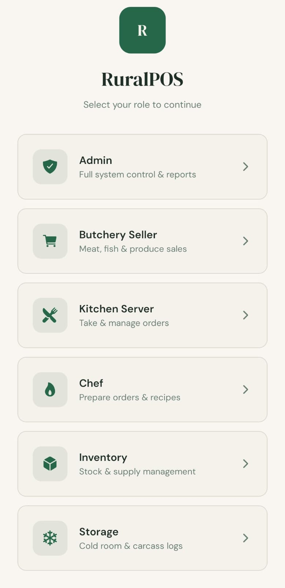
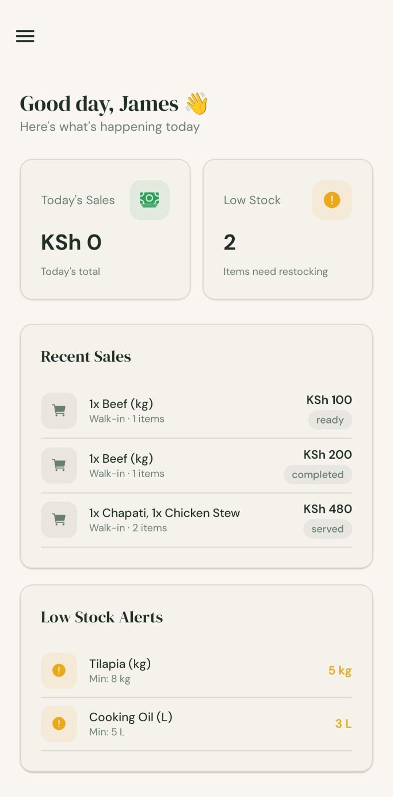
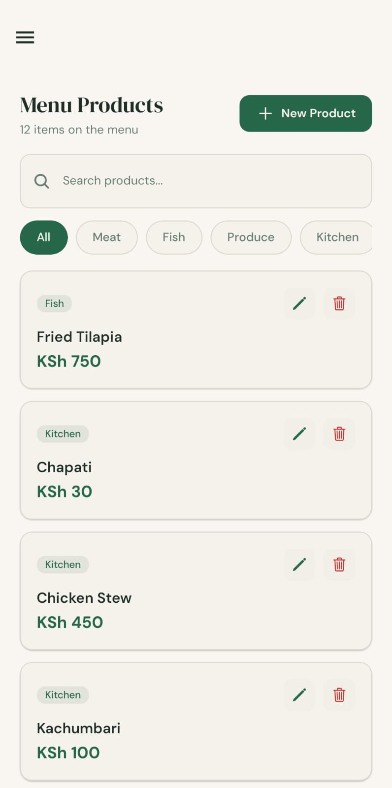

# RuralPOS — Offline-First Point of Sale System

RuralPOS is an offline-first point of sale system designed for butcheries, kitchens, and restaurants operating in environments with unreliable or intermittent internet connectivity. The system allows businesses to continue operating normally during network outages while automatically synchronizing data with the cloud when connectivity becomes available.



---

## Overview

Many small and medium-sized food businesses operate in locations where stable internet connectivity cannot be guaranteed. Most commercial POS solutions depend on continuous internet access, which often results in downtime, lost sales records, and operational disruption during outages.

RuralPOS addresses this challenge by adopting a local-first architecture. All operations are executed against a local database, allowing the system to function entirely offline. Once connectivity is restored, data is synchronized with the cloud to ensure consistency across devices.

---

## Core Features

| Feature | Description |
|-------|-------------|
| Offline-First Operation | The system runs on a local SQLite database and remains fully functional without internet access. |
| Automatic Cloud Synchronization | Data is synchronized with the cloud using Supabase Realtime once connectivity becomes available. |
| Multi-Platform Access | Includes a mobile application built with React Native and a web-based management dashboard. |
| Role-Based Access Control | Separate workflows and permissions for Admin, Butchery, Kitchen, Chef, and Inventory users. |
| Multi-Tenant Architecture | Each business operates within an isolated tenant environment using a shared backend infrastructure. |
| License Key System | Subscription-based licensing with an offline grace period for uninterrupted operation. |
| Over-the-Air Updates | Application updates can be delivered remotely without requiring physical device access. |
| Background Synchronization | Scheduled background tasks maintain data consistency even when the application is not actively open. |
| Reporting and Analytics | Sales summaries, revenue trends, and operational performance insights. |
| Receipt Printing | Support for thermal receipt printers used in retail environments. |
| Cold Storage Tracking | Management of freezer inventory with product type and storage date tracking. |
| Carcass Record Management | Tracks purchase weight, yield percentage, and waste for meat processing operations. |
| Audit Logging | Important system actions are logged to maintain operational accountability. |

---

## Screenshots

<p align="center">
  
  
</p>

<p align="center">
  
</p>

---

## System Architecture

The platform follows a hybrid local-first and cloud-synchronized architecture designed for reliability in low-connectivity environments.

```
Mobile Devices (Primary POS)
React Native · Expo · SQLite · Zustand

      Butchery POS
      Kitchen Display
      Chef Station
      Inventory Management
            │
            ▼
        Local SQLite
   (Primary data store)
            │
            ▼
      Synchronization Layer
   Queue-based + Realtime WebSockets
            │
            ▼
        Supabase Cloud
     PostgreSQL Database
        │        │
        │        ├── Row-Level Security
        │        └── RPC Functions
        │
        └── Realtime Sync
            │
            ▼
       Web Dashboard
     React · Vite Interface

       Admin Portal
       Next.js SaaS Layer
```

A detailed description of the system architecture is available in the `architecture/system-design.md` document.

---

## Technology Stack

| Layer | Technology |
|------|------------|
| Mobile Application | React Native, Expo SDK, TypeScript |
| Local Database | SQLite via expo-sqlite |
| State Management | Zustand |
| Cloud Backend | Supabase (PostgreSQL, Realtime, RPC) |
| Web Dashboard | React, Vite, Tailwind CSS |
| Admin Portal | Next.js |
| Mobile Navigation | React Navigation |
| Web Routing | React Router |
| Application Updates | Expo OTA Updates |
| Background Tasks | Expo Background Fetch |

---

## User Roles and Responsibilities

| Role | Main Interface | Responsibilities |
|------|---------------|-----------------|
| Admin | Dashboard | System configuration, user management, reporting |
| Butchery Staff | POS Interface | Sales processing, carcass tracking, cold storage updates |
| Kitchen Staff | Kitchen Display | Viewing and managing incoming orders |
| Chef | Preparation Station | Food preparation workflow and order status updates |
| Inventory Manager | Inventory Panel | Product catalog management and stock monitoring |

---

## Data Synchronization Strategy

The system implements a queue-based synchronization model to maintain data consistency while prioritizing offline functionality.

1. **Local Write Operations**  
   All transactions are written immediately to the local SQLite database.

2. **Queued Synchronization**  
   Changes are placed in a synchronization queue for upload to the cloud when connectivity is available.

3. **Realtime Updates**  
   Supabase Realtime distributes updates across connected devices.

4. **Background Synchronization**  
   Periodic background tasks ensure data remains synchronized even when the application is inactive.

5. **Conflict Resolution**  
   A last-write-wins policy is applied, with the cloud serving as the authoritative source for distributed updates.

---

## License

This repository is provided for demonstration and portfolio purposes only.  
The complete production source code and internal infrastructure are not publicly distributed.

Refer to the `LICENSE` file for further information regarding usage restrictions.

---

## Contact

For demonstrations, licensing inquiries, or collaboration opportunities, please open an issue in this repository or reach out via the provided contact channels.
